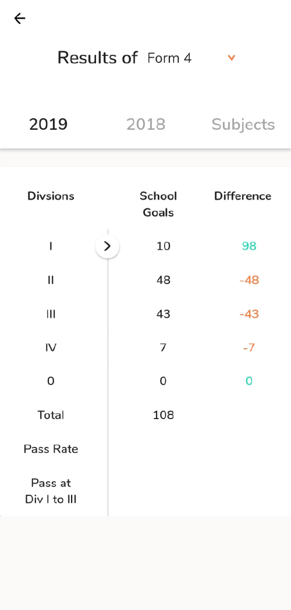
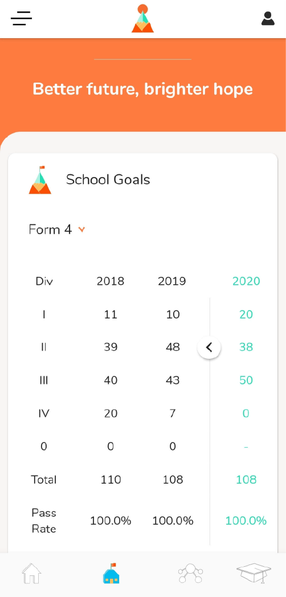
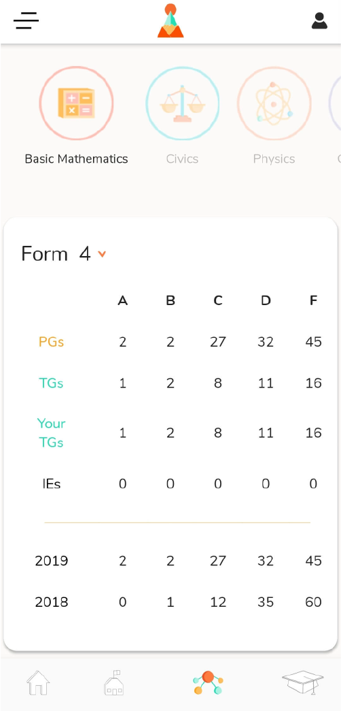
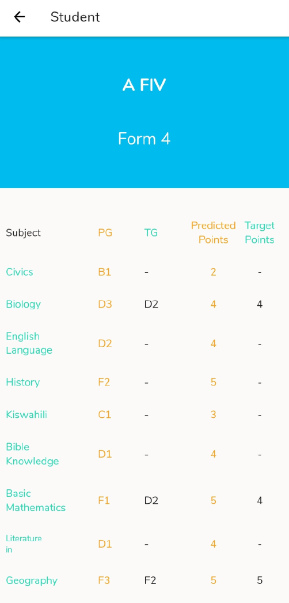
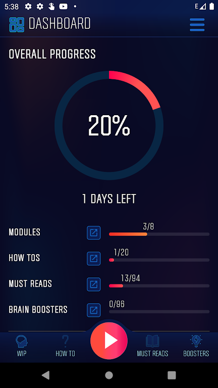
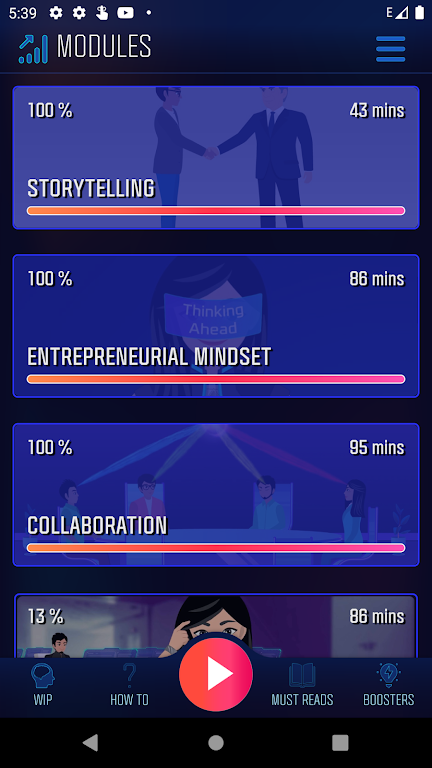
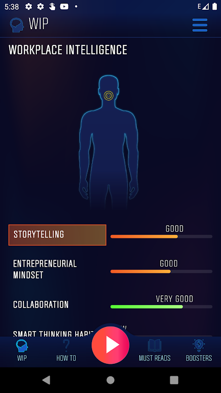
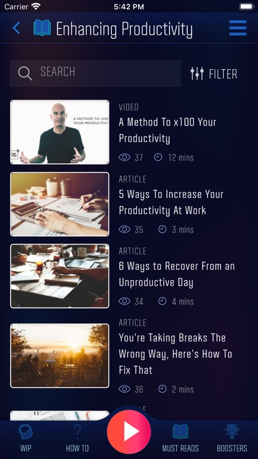
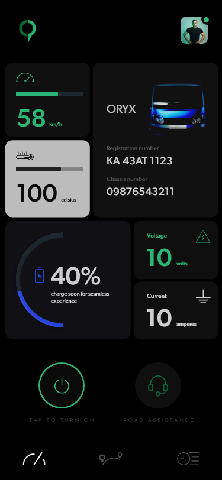
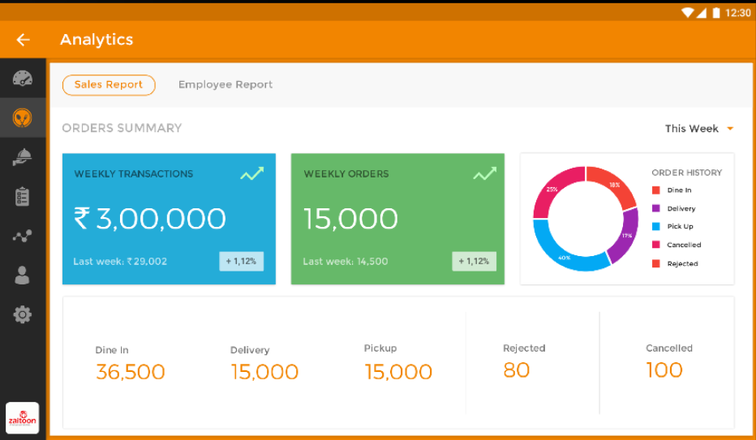

`Flutter` `Node.js` `GraphQL` `React.js` ` Typescript` `GCS `

- ### [PiXL](https://agnostech.in/case-study/pixl-international.html)
  - Automated the calculation of minimum target grade requirement per subject from **400,000+** students records by using `Node.js`,`GraphQL` and `PostgreSQL Triggers`
  #### Head Teacher View
    | Home | School Goal History | Setting School Goals |
    | :------------------------------: | :---------------------------: |:---------------------------: |
    |  |  |  |

    | Calendar to schedule extra 1:1 sessions | Grade distribution of students in one course | Student Grade across courses |
    | :------------------------------: | :---------------------------: |:---------------------------: |
    |  |  |  |
- ### [X Billions Skills Lab](https://agnostech.in/case-study/xbillion-skills-lab.html)
  - Modified the `Flutter` video player for video playlist playback and timestamp-based quizzes on [XBSL](https://workverse.in/), used by **20,000+** professionals and students
  | Dashboard | Pre-determined Coursework | Impact of Coursework on your Workplace Intelligence |
    | :------------------------------: | :---------------------------: |:---------------------------: |
    |  |  |  |

    | XBSL exclusive articles | Coursework Quizes | Articles and Blogs progress |
    | :------------------------------: | :---------------------------: |:---------------------------: |
    |  |  |  |

- ### [Cell Propulsion](http://www.cellpropulsion.com/home.html)
  - Optimized location logging for [Cell Propulsion](https://cellpropulsion.com/home.html) fleet management system using `Google Cloud Services` and efficient caching to mitigate network loss.

| Home Page displaying sensor info | Alerts when sensor info is critical |   Current/Upcoming Trips    |
| :------------------------------: | :---------------------------------: | :-------------------------: |
|        |         |  |

|            Trip Details            |            Trip History            |            Profile            |
| :--------------------------------: | :--------------------------------: | :---------------------------: |
|  |  |  |

- ### Taeble
  - Designed a restaurant management system that targeted 3 different user groups with one mobile application by using Firebase Login and MVVM architectural pattern.
  - ****Placing Orders****
    
  - ****Viewing Current Orders****
    
  - ****Menu Management****
    
  - ****Sales Analytics****
    

- ### Mutualité Sociale Agricole Reclamation
  - Streamlined claim filing process for [MSA](https://www.msa.fr/lfp) using a feature-rich and responsive form with `GraphQL` subscriptions, used by **13,000+** MSA Delegates