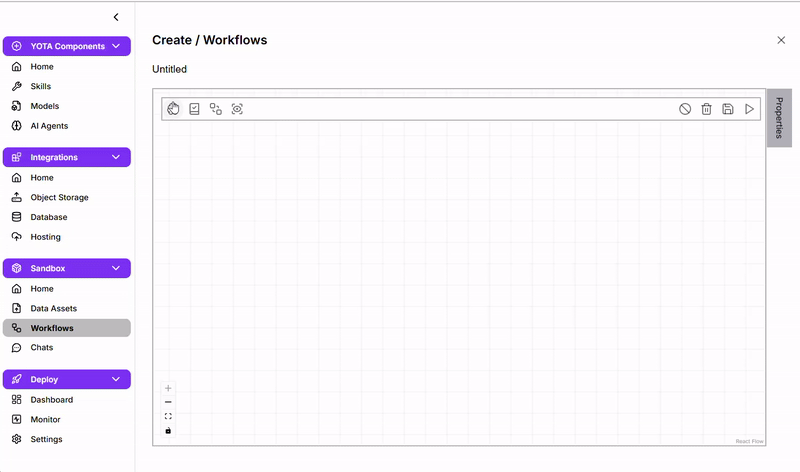
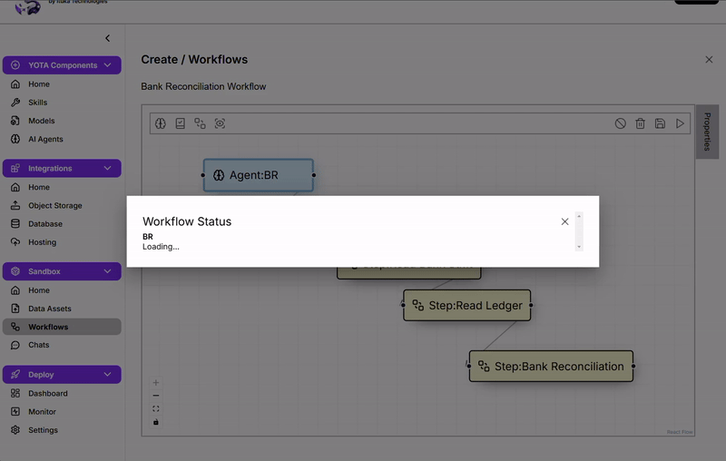
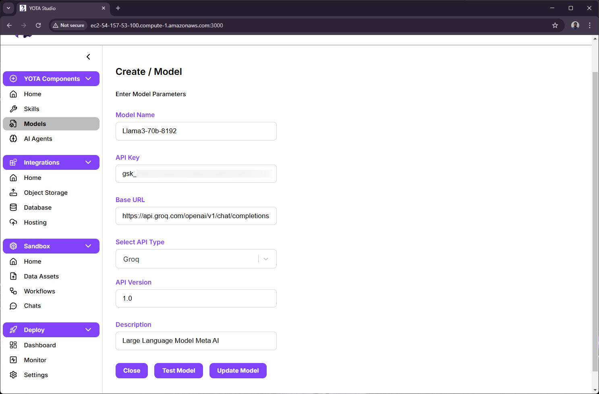
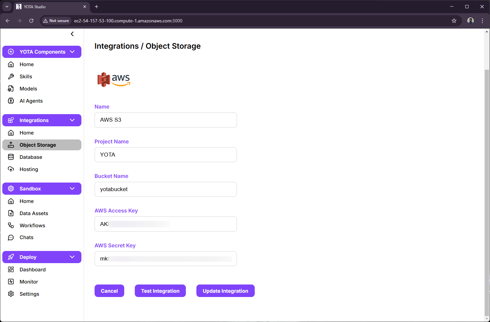
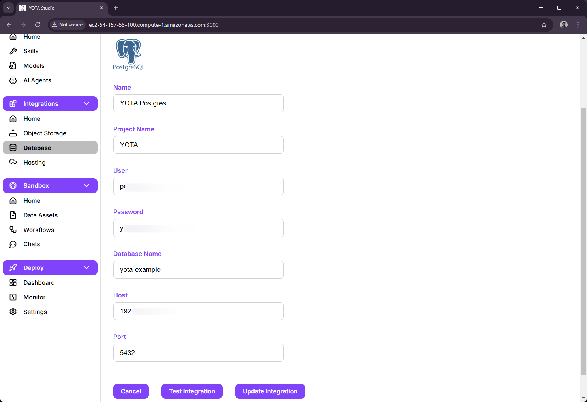

`React` `Node.js` `Postgres` `Typescript` `Flask` `EC2`

- Reduced workflow creation time by **30%** by designing a drag-and-drop builder in React using react-flow and useReducer, with react-hook-form and zod for dynamic node validation.
   

- Achieved up to 40% faster processing of user-defined workflows by building a concurrent task execution system in Flask with DFS, multithreading, and subprocess handling.
  

-  Built Node.js backend services for real-time SSE updates using Kafka and integrated CRUD operations across AWS S3, IBM COS, Groq, and OpenAI
    - **LLM Model Integration**
        
    - **Object Storage Integration**
        
    - **Database Integration**
        

