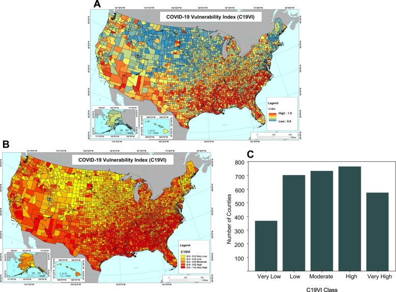

`Python` `Pandas` `Google Colab` `numpy` `scikit` `matplotlib` `ODE Models`

- Developed an automated [COVID-19 SIR Epidemic Modeling](https://pubmed.ncbi.nlm.nih.gov/33940747/) system using [`CovsirPhy`](https://lisphilar.github.io/covid19-sir/) to study the impact of COVID-19 across **3000+** US counties

  
  [_Result of COVID-19 vulnerability modeling_](https://pubmed.ncbi.nlm.nih.gov/33940747/)

- Given a county, state name and time period, the script would generate 9 graphs that potray the impact of COVID-19 on that county.
  

_The above image depicts the impact of COVID-19 on **Cook** County in the state of **Illinois** between February 2020 - May 2021 based on data from the [JHU Repository](https://github.com/CSSEGISandData/COVID-19)_

1. _Row 1 ([Community Level](https://www.cdc.gov/coronavirus/2019-ncov/your-health/covid-by-county.html))_

- _`Daily Cases`: 7-day averaged daily cases over time_
- _`Hospitalization Cases Vs Community Level(CL) Trend`: Hospitalization Cases and Community Level (CDC Method) plotted over specified time interval_
- _`Overall CL Trend`: Overall CL trend plotted on a map of the county_

2.  _Row 2 ([Reproduction Number](https://en.wikipedia.org/wiki/Basic_reproduction_number))_

- _`Susceptible-Infected-Recovered`: Plot showing Susceptible Vs Infected Vs Recovered or Dead population_
- _`Reproduction Number(R0)`: Plot showing R0 over time with breakpoints indicating shift in trend. Accompanied with table showing detailed changes_
- _`Overall R0 Trend`: Overall R0 trend plotted on a map of the county_

3.  _Row 3 (Infection Fatality Rate)_

- _`Daily Deaths`: 7-day averaged daily deaths over time_
- _`Average Infection Fatality Rate(IFR)`: Plot showing IFR over time with breakpoints indicating shift in trend. Accompanied with table showing detailed changes_
- _`Overall IFR Trend`: Overall IFR trend plotted on a map of the county_
