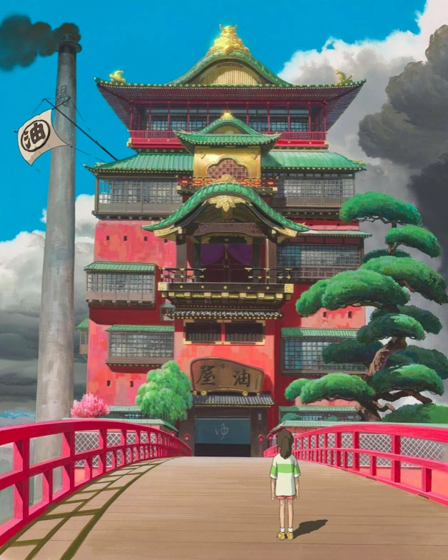

Inspired by the [Studio Ghibli](https://en.wikipedia.org/wiki/Studio_Ghibli) Movie [Spirited Away](https://en.wikipedia.org/wiki/Spirited_Away), I took on a craft project during the pandemic to craft a diorama of the famous bath house "Aburaya".

_Still of the bathhouse "Aburaya" from the movie_

### My rendition of Aburaya(油屋) as a diorama

|                               |
| :---------------------------: | :--------------------------: |
|       |  |
|  |         |
