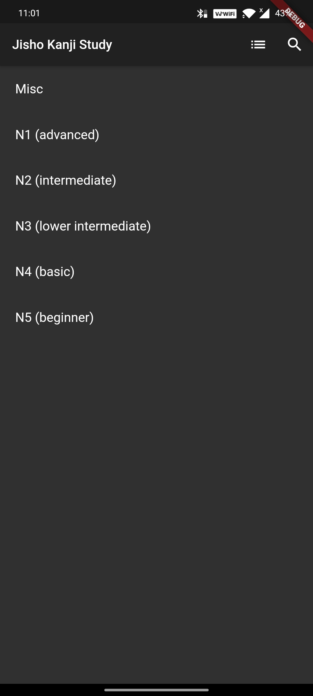
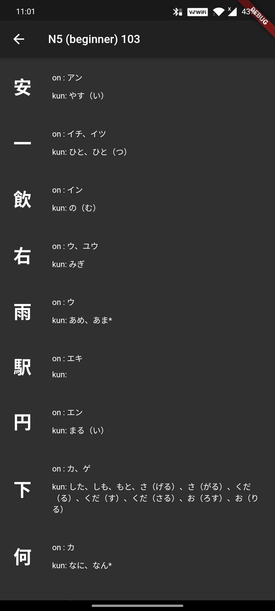
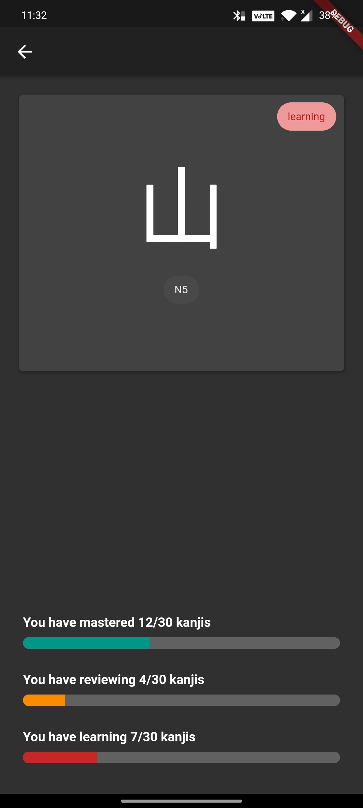
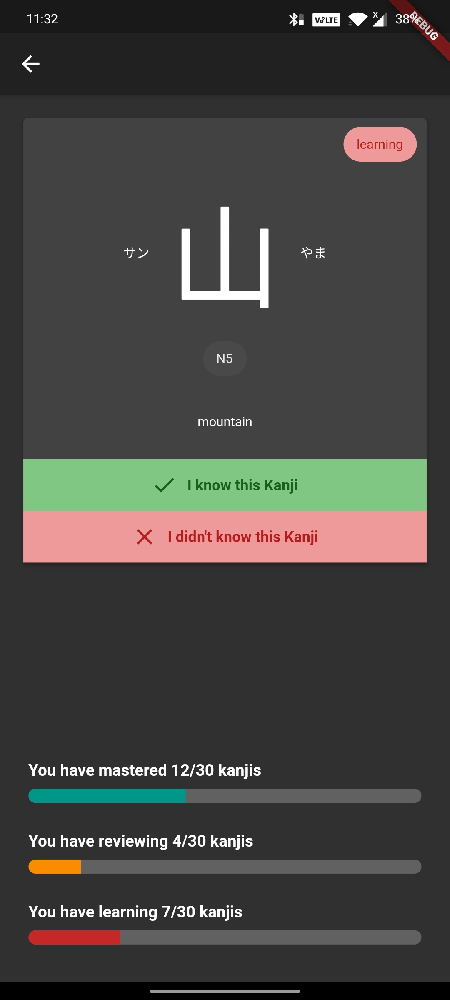

- Designed and developed a dynamic flashcard application utilizing encrypted SharedPreference and SQLite to optimize Japanese Kanji memorization.

|             Kanji Level             |      List of Kanji in that Level      |
| :---------------------------------: | :-----------------------------------: |
|       |          |
|             Kanji Quiz              |          Answer to the quiz           |
|  |  |
