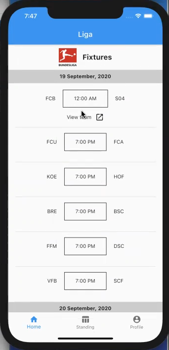
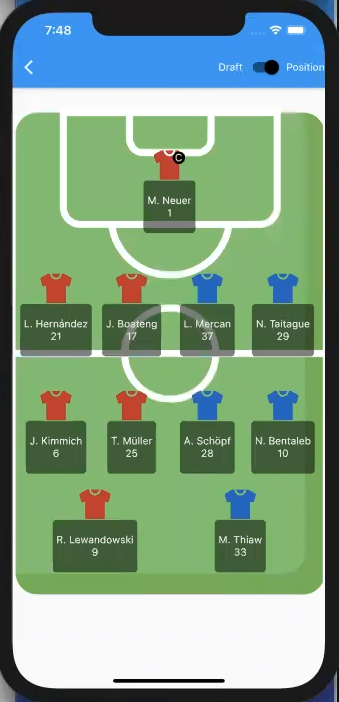
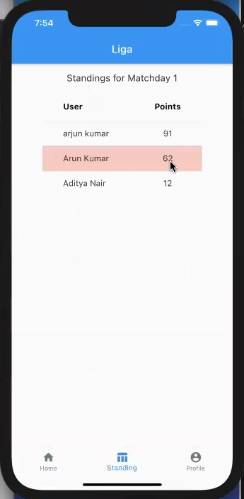
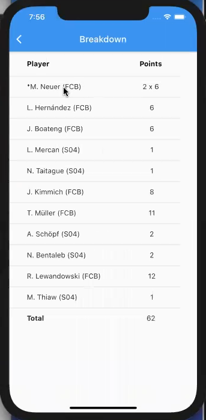

`Flutter` `Node.js` `GraphQL` ` Typescript` `Heroku`

- Prototyped a fantasy football app that enabled users to leverage their knowledge in football(Bundesliga) for reward

- Pitched the MVP at [WHU School of Management](https://www.whu.edu/en/)’s (Germany) 3 Day Startup Bootcamp(3DS)

|          Match Fixtures          |   Player Draft and Position   |
| :------------------------------: | :---------------------------: |
|  |  |

|      Standings after a match      |  Breakdown of individual points   |
| :-------------------------------: | :-------------------------------: |
|  |  |
